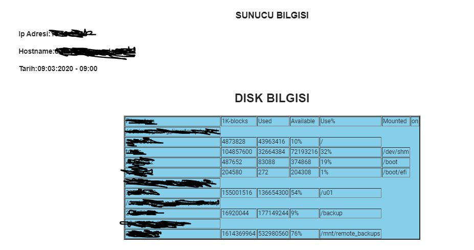
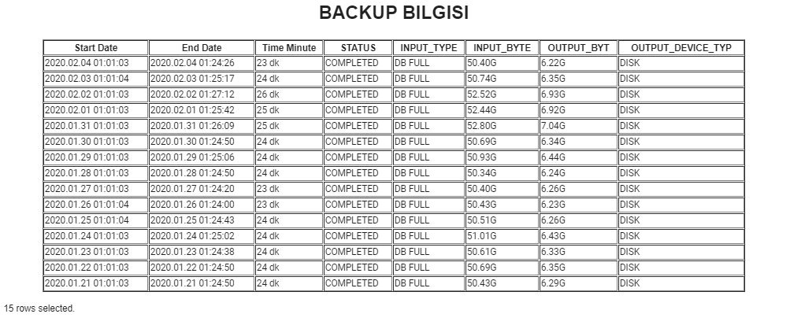
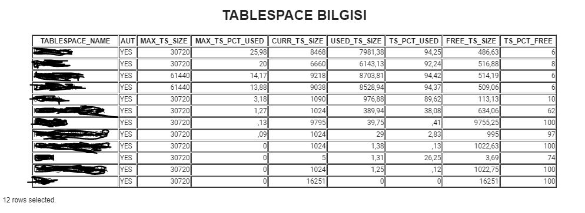

### Linux Automation System 🎉

An Application that automates linux systems.

### Features

✔️ Disk check

✔️ Backup check

✔️ Tablespace check

✔️ Log check

### Technologies used;

✔️ Bash Programming

✔️ PL/SQL

✔️ HTML, CSS

    

    

    

